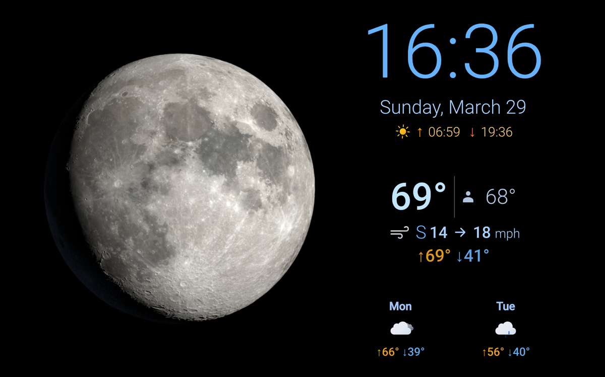

# Weather Kiosk Display

A weather kiosk app for a repurposed Android tablet. Displays current weather conditions and moon phase visualization.

Built with TypeScript and [Lit](https://lit.dev/) web components. Deployed from a Debian-based development machine to an Android tablet via ADB.



## Design

The UI is composed of small, focused Lit elements. Each element handles a specific concern (clock, moon phase, current conditions, forecast).

### Service Layer

Data fetching is isolated in service classes:
- **[`WeatherService`](src/services/weather-service.ts)** — orchestrates OpenWeatherMap API calls and data processing
- **[`NasaMoonService`](src/services/nasa-moon-service.ts)** — handles NASA Dial-a-Moon API interactions

### State Management

Weather data is shared via Lit's [Context API](https://lit.dev/docs/data/context/). The [`x-weather`](src/elements/weather.ts) component fetches data every 10 minutes and provides it to child components (`x-sun-times`, `x-current-conditions`, `x-forecast`) through context.

### Error Handling

Components bubble `error-occurred` [custom events](https://lit.dev/docs/components/events/#dispatching-events) up to `x-root`, which displays them via an overlay.

## Development

### Local dev environment setup

```bash
cp .env.example .env.local
```

Edit `.env.local` and set [OpenWeatherMap API key](https://openweathermap.org/api) and coordinates.

### Initialization

```bash
fnm use
corepack enable
pnpm install
```

### Common development tasks
- `pnpm dev`: Start development server with hot reload
- `pnpm validate`: Run linting + all tests + build
- `pnpm test:coverage`: Create test coverage report (`coverage/index.html`)
- `pnpm knip`: Find unused exports, files, and dependencies

## Deployment

### Tablet Setup

#### Install Kiosk App
1. Install [Fully Kiosk Browser](https://www.fully-kiosk.com/) from Google Play

#### Enable Developer Mode
1. Settings → About tablet → Software information
    * Tap Build Number 7 times
2. Settings → Developer options
    * Turn on USB debugging

### Deploy to tablet (from Debian-based OS)

#### Prerequisite: Install Android Debug Bridge
```bash
sudo apt install android-tools-adb
adb devices
```

#### Deployment Commands
- `./deploy.sh`: Build app, clean device, and deploy files to device
- `./deploy.sh -l`: List deployed files on device
- `./deploy.sh -c`: Clean/remove all deployed files from device


## Appendix

### Weather Icons
The SVG weather icons in `public/weather-icons/` are sourced from [basmilius/weather-icons](https://github.com/basmilius/weather-icons).
